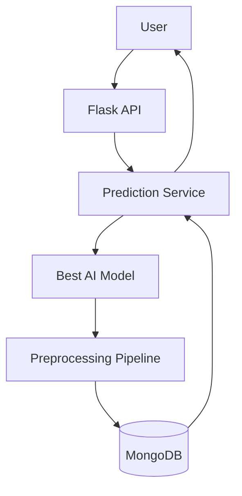
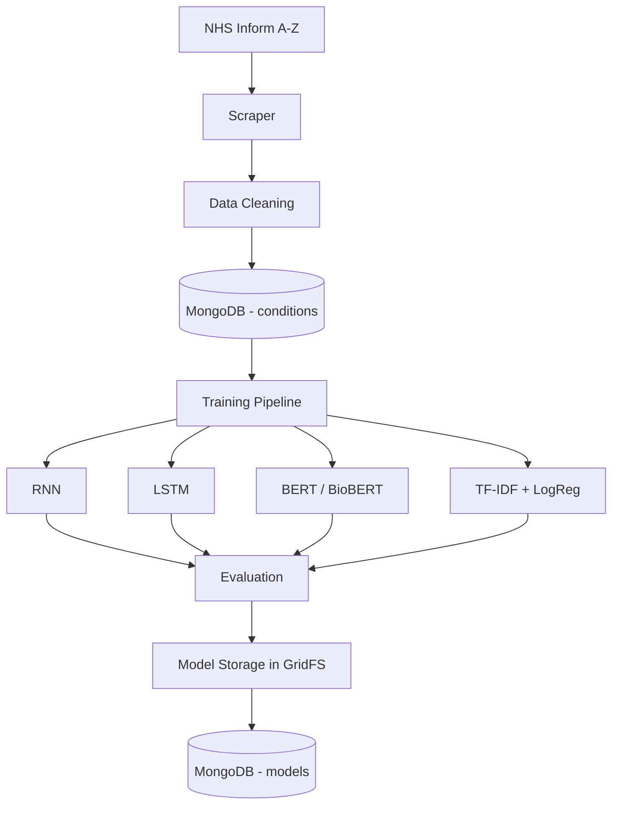

# Medical Diagnosis AI (Educational Project)

An AI-powered symptom-to-condition prediction system built on scraped NHS
Inform condition data: web scraping → MongoDB → preprocessing → four
comparable models (TF-IDF+LogReg baseline, RNN, LSTM, BERT/BioBERT) →
evaluation & best-model selection → Flask prediction API with
warnings/recommendations attached.

> **This is a student/educational project, not a medical device.** See
> [Medical Safety Disclaimer](#medical-safety-disclaimer).

---

## 1. Project Overview

Pipeline:

```
NHS Inform A-Z → Scraper → MongoDB (conditions) → Preprocessing →
Dataset (multi-label) → [TF-IDF+LogReg | RNN | LSTM | BERT/BioBERT] →
Evaluation & Comparison → Best Model → GridFS + MongoDB (models) →
Flask Prediction API → ranked conditions + warnings + recommendations
```

## 2. Architecture

**Runtime prediction flow:**



**Offline training/data pipeline:**



## 3. Technologies
Python 3.10+, Flask, MongoDB + PyMongo + GridFS, Requests + BeautifulSoup,
pandas/NumPy, scikit-learn, TensorFlow/Keras (RNN, LSTM), PyTorch +
HuggingFace Transformers (BERT/BioBERT), pytest + mongomock.

## 4. Project Structure
```
medical_diagnosis_ai/
├── app/
│   ├── config.py                 # all configuration, env-driven
│   ├── database/                 # connection, schemas/repositories, GridFS
│   ├── scraper/                  # NHS Inform scraper + HTML parser
│   ├── preprocessing/            # cleaning, dataset builder, reusable pipeline
│   ├── models/                   # baseline, RNN, LSTM, transformer, evaluation, selection
│   ├── services/                 # scraping/training/prediction orchestration
│   ├── api/                      # Flask blueprints (data, preprocessing, model)
│   └── utils/                    # logging, validators
├── scripts/                      # CLI entry points mirroring the APIs
├── tests/                        # pytest suite (offline, mocked externals)
├── reports/experimentation_report.md
├── data/{raw,processed,artifacts}/
├── requirements.txt
├── .env.example
├── run.py
└── README.md
```

## 5. Installation

```bash
cd medical_diagnosis_ai
python3 -m venv venv && source venv/bin/activate
pip install -r requirements.txt
cp .env.example .env   # then edit values as needed
```

TensorFlow and PyTorch/Transformers are the heaviest dependencies (RNN/LSTM
and BERT/BioBERT respectively). If you only want the baseline model and
APIs working, you can comment those two lines out of `requirements.txt`
and skip Sections 9/10 below.

## 6. MongoDB Setup

Run MongoDB locally (or point at Atlas / any reachable instance):

```bash
# local, via Docker
docker run -d -p 27017:27017 --name mongo mongo:7

# or install MongoDB Community Server directly and start the mongod service
```

Set `MONGO_URI` in `.env` accordingly (default: `mongodb://localhost:27017`).
Indexes on `conditions.condition` (unique) and `models.name` (unique) are
created automatically on Flask app startup (`ensure_indexes()`), and can
also be triggered manually:

```bash
python3 -c "from app.database.connection import ensure_indexes; ensure_indexes()"
```

## 7. Environment Variables
See `.env.example` for the full list (Mongo URI/DB/collections, scraping
limits/rate-limit/timeouts, dataset split ratios, TF-IDF/LogReg params,
RNN/LSTM hyperparameters, transformer model name/hyperparameters,
Flask host/port). Nothing is hard-coded in code — every one of these is
read via `app/config.py`.

## 8. Scraping

```bash
# CLI
python3 scripts/run_scraper.py --limit 20

# or via the API (server must be running -- see Section 12)
curl -X POST http://localhost:5000/api/data/scrape -H "Content-Type: application/json" -d '{"limit": 20}'
```

`SCRAPER_MAX_CONDITIONS` (or `--limit`) caps how many *new* conditions are
scraped per run, for safe development/testing before a full run.
Already-stored conditions are skipped unless `force_refresh` is set.

## 9. Preprocessing

```bash
python3 scripts/run_preprocessing.py
# or: POST /api/preprocessing/prepare-dataset
```

Builds the multi-label dataset (see `app/preprocessing/dataset_builder.py`
docstring for the full documented strategy — real scraped rows + clearly
tagged synthetic resampled rows), fits and saves the label encoder to
`data/artifacts/`.

## 10. Training

```bash
python3 scripts/train_baseline.py     # TF-IDF + Logistic Regression
python3 scripts/train_rnn.py          # RNN (requires TensorFlow)
python3 scripts/train_lstm.py         # LSTM (requires TensorFlow)
python3 scripts/train_transformer.py  # BERT/BioBERT (requires torch+transformers, network to HF Hub)
python3 scripts/evaluate_models.py    # trains+evaluates all four, prints comparison + best-model choice
# or via API: POST /api/model/train  { "model_types": ["tfidf_logreg","rnn","lstm","transformer"] }
```

Each trained model's artifact is uploaded to MongoDB GridFS and its
metadata (name, type, gridfs_id, labels, metrics, created) is written to
the `models` collection.

## 11. Model Comparison & Storage
`GET /api/model/list` — all saved model metadata.
`GET /api/model/best` — currently selected best model + explanation
(composite of Top-3 accuracy and emergency recall — see
`app/models/model_selector.py`).

## 12. Running Flask

```bash
python3 run.py
# Flask runs at http://<API_HOST>:<API_PORT>, default http://0.0.0.0:5000
```

## 13. API Endpoints

### Data Handling API
| Method | Path | Body | Description |
|---|---|---|---|
| POST | `/api/data/scrape` | `{"limit": 20, "force_refresh": false}` | Run scraper, upsert into MongoDB |
| GET | `/api/data/conditions?limit=N` | — | List stored conditions |
| GET | `/api/data/conditions/<name>` | — | Fetch one condition |

### Preprocessing API
| Method | Path | Description |
|---|---|---|
| POST | `/api/preprocessing/prepare-dataset` | Build multi-label dataset, fit+save pipeline |
| GET | `/api/preprocessing/stats` | Last-built dataset statistics |

### Model API
| Method | Path | Body | Description |
|---|---|---|---|
| POST | `/api/model/train` | `{"model_types": [...]}` (optional) | Train/evaluate/persist models |
| GET | `/api/model/list` | — | All saved model metadata |
| GET | `/api/model/best` | — | Currently selected best model |
| POST | `/api/model/predict` | `{"symptoms_text": "...", "age": 34, "gender": "female", "top_n": 5}` | Ranked condition predictions |

`GET /api/health` — liveness + MongoDB connectivity check.

## 14. Prediction Example

```bash
curl -X POST http://localhost:5000/api/model/predict \
  -H "Content-Type: application/json" \
  -d '{"symptoms_text": "I have a high fever, sore throat, headache and difficulty swallowing.", "age": 29, "gender": "female"}'
```

```json
{
  "predictions": [
    {"condition": "Tonsillitis", "probability": 0.82, "warnings": "...", "recommendations": "..."},
    {"condition": "Strep throat", "probability": 0.61, "warnings": "...", "recommendations": "..."}
  ],
  "model_used": {"name": "tfidf_logreg_v1", "type": "tfidf_logreg"},
  "disclaimer": "This system provides educational, model-generated possibilities... NOT a medical diagnosis..."
}
```

## 15. Testing

```bash
pip install pytest mongomock
python3 -m pytest tests/ -v
```

29 tests cover scraper parsing (offline HTML fixtures), preprocessing,
database repositories (via `mongomock`), evaluation/model-selection logic,
the prediction service (mocked model/pipeline), and all Flask endpoints
(mocked services). All 29 pass in this build environment. RNN/LSTM/
transformer *training* itself is not exercised by the test suite (that's
an integration/experiment run, not a unit test) — see Section 18 Known
Limitations.

## 16. Known Limitations

**In this build/sandbox environment specifically:**
- Outbound network access is restricted to a small allowlist that does
  **not** include `nhsinform.scot` or the HuggingFace Hub, so the scraper
  and transformer fine-tuning could not be executed live here. The code
  is complete and correct; running it requires an environment with
  standard internet access.
- No MongoDB server is running in this sandbox, so DB writes/reads were
  validated using `mongomock` in tests and a local in-memory smoke test,
  not a real `mongod` instance.
- No GPU is available here, so full RNN/LSTM/BERT training runs to
  completion were not executed; `reports/experimentation_report.md`
  marks those metrics as `[Run experiment to populate this value]` rather
  than inventing numbers.

**General / architectural:**
- Synthetic training rows are combinatorial resamples of real scraped
  phrases (documented in `dataset_builder.py`), not independently
  verified clinical presentations.
- "Emergency" condition detection is a keyword heuristic over NHS
  warning text, not a clinical triage system.
- The `warnings`/`recommendations` HTML-section parser targets NHS
  Inform's current markup patterns with fallback heading matching; a
  future site redesign may require selector updates.

## 17. Medical Safety Disclaimer

This system is an **educational AI project**. It does **not** provide a
medical diagnosis, does not replace professional medical advice, and
must not be used to make real clinical decisions. Every prediction API
response includes this disclaimer. If you are experiencing a medical
emergency, contact emergency services immediately.

---

## 18. Requirement Compliance Audit

| PDF Requirement | Implemented? | File/Module | Evidence |
|---|---|---|---|
| Scrape NHS Inform A-Z → MongoDB | Yes (code complete; not executed live here — network restricted) | `app/scraper/nhs_scraper.py`, `parser.py` | Retry/backoff session, rate limiting, dedup, configurable limit; unit-tested parsing in `tests/test_scraper.py` |
| Conditions collection schema (condition, symptoms, causes, warnings, recommendations) | Yes | `app/database/schemas.py::ConditionDocument` | `validate_condition_doc`, tested in `tests/test_database.py` |
| Models collection schema (name, type, gridfs_id, labels, metrics, created) | Yes | `app/database/schemas.py::ModelDocument` | `validate_model_doc`, tested |
| MongoDB indexes | Yes | `app/database/connection.py::ensure_indexes` | Unique index on `condition`, `name` |
| Data cleaning/preprocessing, reusable train+inference | Yes | `app/preprocessing/text_cleaning.py`, `pipeline.py` | Same functions called at training and inference time |
| Multi-label problem formulation + documented dataset-generation strategy | Yes | `app/preprocessing/dataset_builder.py` | Full docstring; real vs synthetic rows tagged; tested |
| TF-IDF + Logistic Regression baseline | Yes, executed (smoke test) | `app/models/baseline_tfidf.py` | Metrics in `reports/experimentation_report.md` §6 |
| RNN (Embedding→SimpleRNN→Dense) | Yes, code complete; not executed here (no TensorFlow install/GPU in this run) | `app/models/rnn_model.py` | EarlyStopping + ModelCheckpoint included |
| LSTM (Embedding→BiLSTM→Dense) | Yes, code complete; not executed here | `app/models/lstm_model.py` | Same training regime as RNN |
| BERT/BioBERT fine-tuning | Yes, code complete; not executed here (no network to HF Hub / no GPU) | `app/models/transformer_model.py` | Configurable checkpoint name, logged fallback, HF `Trainer` |
| Model comparison: Top-K accuracy, emergency recall, precision/recall/F1 | Yes | `app/models/evaluation.py` | Tested in `tests/test_model_loading.py` |
| Best model selection from real results | Yes | `app/models/model_selector.py` | Composite score; documented, auditable, no BERT-bias |
| Prediction from free text + age/gender, ranked, with warnings/recommendations | Yes | `app/services/prediction_service.py` | Tested end-to-end (mocked model) in `tests/test_prediction.py` |
| Data Handling API | Yes | `app/api/data_api.py` | `/api/data/scrape`, `/api/data/conditions[/<name>]` |
| Preprocessing API | Yes | `app/api/preprocessing_api.py` | `/api/preprocessing/prepare-dataset`, `/stats` |
| Model API (train/load/predict) | Yes | `app/api/model_api.py` | `/api/model/train`, `/list`, `/best`, `/predict` |
| Model storage in MongoDB/GridFS, retrievable without retraining | Yes | `app/database/gridfs_store.py`, `training_service.py::_save_model_record`, `prediction_service.py::_load_model_for_inference` | Handles sklearn bundle, Keras `.keras` file, zipped HF directory |
| Configuration via environment variables, no hard-coding | Yes | `app/config.py`, `.env.example` | All URIs/limits/hyperparameters/model names configurable |
| Project structure separated by responsibility | Yes | (this tree) | Matches PDF's suggested structure |
| Tests: scraper, preprocessing, DB, prediction, API, model loading | Yes | `tests/*.py` | 29/29 passing in this environment |
| README with all 17 required sections | Yes | this file | Sections 1–17 above |
| Architecture diagram | Yes | this file, §2 | Mermaid diagrams (prediction flow + training flow) |
| Experimentation report | Yes, populated with a real smoke-test run; full-scale numbers pending live execution | `reports/experimentation_report.md` | No fabricated metrics; placeholders explicit |
| Medical-AI safety rules (no diagnosis claims, disclaimer, preserved NHS content, linked warnings) | Yes | `prediction_service.py`, `config.py::MEDICAL_DISCLAIMER`, README §17 | Disclaimer returned in every prediction response |
